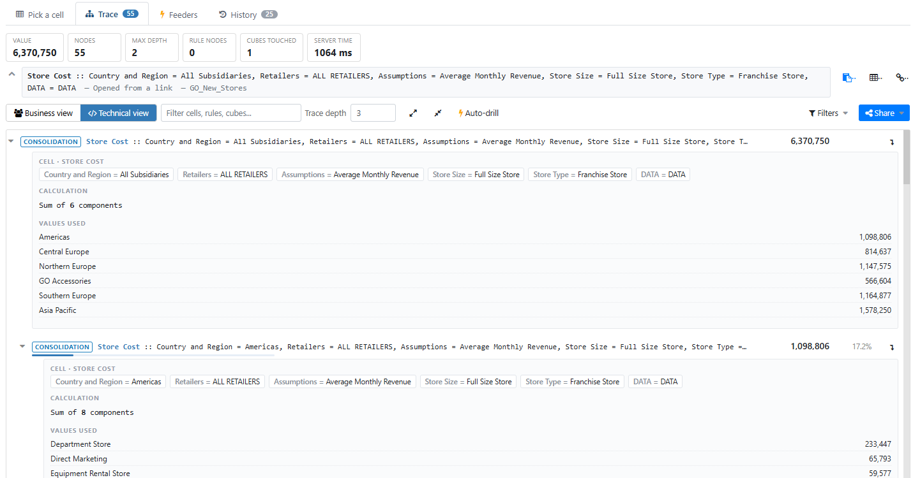
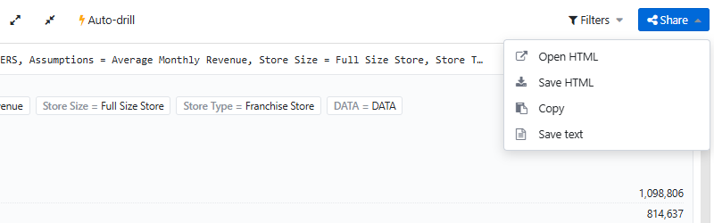

# Calculation Explorer — user guide

**v1.18.1** · Arc for TM1 6.0 · a plugin for answering *where did this number come from?*

This guide is for the person **using** the plugin. If you are changing it, read `README.md` next to
this file, then `PROJECT-PLAN.md` in the repository.

---

## 1. What it is for

You are looking at a number in a cube view and it is wrong, or surprising, and you need to know
which rule produced it and from what. Arc's built-in trace shows you the rule statement and the
cell's immediate components. Calculation Explorer follows the whole chain — every rule,
consolidation and jump into another cube — labels each step with its cube and full coordinates,
finds each rule statement back in the cube's rule file with its **line number**, and lets you hand
the whole thing to a colleague as **one self-contained HTML file**.

It only ever *reads*. Nothing in this plugin writes to a cube, a rule or a view.

## 2. Getting to it

1. Copy the `calculation-explorer` folder into Arc's `plugins` folder — the one next to `arc.exe`,
   usually `C:\arc\plugins`.
2. **Hard-reload the Arc window**: `Ctrl+Shift+R` (or `Ctrl+F5`).
3. Open **Tools → Calculation Explorer**.

Step 2 is not optional, and it is not the same as restarting Arc. Arc serves every plugin in one
bundle that browsers are told to cache for a year, and that address does not change when a plugin
changes — so without a hard reload you keep running the old copy. The same applies to every update
you install later.


The two checkboxes on the right — **Trace Calculation** and **Trace Feeders** — decide whether Arc's
own cell-menu entries open here instead of Arc's built-in pages. They are independent, and either
one can be turned back off at any time; Arc's own page comes straight back, with no reload.

## 3. Six ways to pick a cell

| Way in | How |
|---|---|
| **From a view** | On **Pick a cell**, choose the instance, then a cube and a view, and click any cell in the grid. Rule-derived cells are shaded and consolidated cells are bold, so the interesting ones stand out. |
| **From the tree** | Right-click a **cube** → *Calculation Explorer* opens on that cube. Right-click a **view** → it opens with that view loaded, ready for a click. |
| **From the cell itself** | Right-click a cell in the cube viewer → **Trace Calculation**. Arc's own menu item opens *this* plugin on that cell and shows you its value and its rule; the tree is one more click. |
| **Feeders from the cell** | Right-click a cell → **Trace Feeders** opens the **Feeders** tab with that cell's feeders already checked. |
| **By pasting or typing** | Set *Start from* to **Coordinates I type** and either fill the rows in or paste a cell reference (below). **An MDX statement** works too, for a cell that is in no saved view. |

Rows 3 and 4 replace Arc's built-in pages, and they are two separate settings. Under **Open Arc's
cell menu here** on the **Pick a cell** tab there is a checkbox for **Trace Calculation** and one for
**Trace Feeders**: untick either to get that built-in page back, tick it to take it over again. Both
take effect immediately, with no reload, and they are independent — so you can keep Arc's feeder page
and still have calculation traces open here, or the reverse.

> If a box and what actually happens ever disagree, hard-reload Arc (`Ctrl+Shift+R`) and say so —
> that was a bug in v1.3.0, fixed in v1.3.1.

### Pasting a cell reference

Right-click a cell in the cube viewer → **Cell Reference** → select the whole table it shows and
paste it into the *Paste a cell reference* box, then **Use this reference**.

```
Dimension            Hierarchy            Element
Country and Region   Country and Region   Americas
Retailers            Retailers            ALL RETAILERS
Assumptions          Assumptions          GMWA
```

Rows are matched **by dimension name**, so their order does not matter, and the hierarchy column is
used for the trace — which is what makes a cell on an alternate hierarchy traceable. Arc's dialog
does not name the cube, so pick the cube on the left first. A two-column table, a plain
`Germany, Feb, Gross Revenue` list in cube dimension order, and a `DB('Cube','Germany','Feb',…)`
formula all work as well. If a paste only covers some dimensions, the matched rows are filled in,
you are told how many, and you complete the rest by hand.

## 4. The four tabs


- **Pick a cell** — instance, where to start from, trace depth, rows per page, and the cell itself.
- **Trace** — the result. Seven cards across the top: *Value*, *Nodes*, *Frontier*, *Max depth*,
  *Rule nodes*, *Cubes touched*, *Round trip*. **Frontier** appears only when the tree was cut, and
  counts the rows you can still fetch deeper from.
- **Feeders** — feeder statements and fed cells for the cell on screen.
- **History** — every trace you have run, with **Re-trace** to run one again. It survives restarts
  (it lives in your Arc preferences) and **Clear history** empties it.

The cell reference sits under the cards. It stays on one line to leave room for the tree; the
chevron unwraps it in full, and the two small buttons copy it — as readable text, or as the
`Dimension / Hierarchy / Element` table Arc's Cell Reference produces, which pastes straight back
into this plugin.

## 5. Reading a trace

### If you asked for a trace, you get a trace

**When you name the trace, the plugin traces.** Right-click a cell in a cube view and choose
*Trace Calculation*, open a link somebody sent you, press *Re-trace* in History, or type
coordinates and press *Trace this cell* — in all four cases the cell and then its tree arrive on
their own, with nothing to press in between. The page tells you what it is doing while it works.

### Clicking a cell in the grid: the cell first, the tree on request

**Browsing** is the one case that still stops after the first step, and deliberately: clicking
around a grid is not the same as asking for a tree. What comes back first is the **cell itself**,
and it arrives in about a second:

- its **value**,
- the **rule that produced it**, with the line number in the cube's rule file,
- its full coordinate, its cube and its instance.

For a great many questions — *which rule is this?*, *is this a rule, a consolidation or a
number somebody typed in?* — that is the entire answer, and you are finished.

When you do want the chain underneath it, press **Build the component tree**. Since v1.12.0 that
request is bounded to your trace depth, so the server builds only the levels you asked for rather
than the whole tree.

**What that costs depends on two things, and only one of them is the depth.** The other is how wide
the cell is. On the demo model, four cells at the default depth of 3 measured **24 KB, 81 KB, 512 KB
and 591 KB**, each in about two seconds — and that model's largest dimension has 39 elements, where
a real one has thousands. Depth then multiplies whatever your cell costs, steeply: the same cell
measured 11.8 MB at depth 5 and 37 MB at depth 6. So raise the depth a little at a time, and use the
caret on a single row to go deeper from just there. Everything else in this section describes what
you get after the tree arrives.

Two cases where you can skip the button:

- a **stored input** says so, because its value is its own — there is nothing underneath it to
  walk;
- a **consolidation** has no rule of its own, so no rule is shown. Its value is the sum of its
  children, and the tree is the only way to see which of them it came from.

The **Feeders** tab works from the previewed cell as well, so a cell's feeders can be checked
without building a tree at all.

### While you are waiting

A trace is one piece of work done by the TM1 server, and on a large cell it takes **15 to 22
seconds or more**. While it runs, the row of tabs carries a spinner, what is happening, which cube,
and how long it has been going:

> ⟳ *Tracing on the server* · Store Cost · **13s**

Three things worth knowing about that line, because they answer the questions people actually ask:

- **The seconds come from TM1 itself**, not from a stopwatch in this page. That matters when a
  connection drops: a page timer would keep counting and tell you a comforting lie, and this one
  stops telling you anything it cannot read from the server.
- **It changes to *Receiving the answer*** for the last stretch. The server has finished walking by
  then and the answer — which can be over a hundred megabytes — is still arriving. The seconds hold
  still at that point, because they are how long the *walk* took.
- **It appears however you started the trace**, including the ways where you clicked nothing on this
  page at all: Arc's own cell menu, a link somebody sent you, or replaying an entry from **History**.

**Clicking again does not make it faster, and the page will not let you.** One trace runs at a time,
the cell being traced is outlined in the grid, and a second click is refused rather than queued.

### Two questions it may ask before starting

The server keeps working on a trace even if you close the page or reload it (an administrator can stop one — see below) — so before starting a
new one, the plugin checks with TM1 and asks you first if something is already running:

| What you see | What is going on | What to do |
|---|---|---|
| *Your last trace is still running on the server (started 12s ago). It will finish whether or not you wait…* | You reloaded, or opened a second tab, while your own earlier trace was still going. This is the usual one. | Waiting is normally right — the answer is coming. Continue anyway if you no longer want that trace's answer, or stop it with **Cancel** if you are an administrator. |
| *Another user (Name) is running a cell trace, started 12s ago. Running two at once increases the server's memory use and slows both.* | Somebody else is tracing on the same TM1 instance. | On a shared server, waiting a few seconds — or asking them — is often quicker than competing. Continue anyway if you would rather not. |

Both end in a choice: nothing here refuses you a trace. And if your own earlier trace is still
running when you open the page, the line described above simply shows it, so a page that used to
look idle now tells you what the server is doing.

Two limits of that check, so it is not read as more than it is. **Nothing is claimed when nothing is
found** — TM1 shows an administrator every running trace and shows everyone else only their own, so
"no question asked" means nothing was *seen*, not that the server is idle. And if the check itself
cannot be made, tracing goes ahead exactly as before rather than blocking you.

### The two views

A trace opens in the **business view**, and for most questions that is the one you want. Toggle to
the **technical view** in the toolbar when you need cubes, full coordinates and rule statements on
every row.


The same trace in the **technical view**, which puts the cube and the full coordinates on every row
and adds a filter box and a **Filters** menu:



In the technical view, **Filters** holds the three controls that narrow what the tree shows — which
cube, whether zero and empty cells are listed, and whether to show only rule-derived cells. The
number on the button is how many of them are on, so an unbadged button means nothing is being
hidden:


| | Business view | Technical view |
|---|---|---|
| Row label | only the part of the coordinate that **changed** — `Feb`, not the whole tuple | `cube :: dim = el, dim = el, …` |
| Breadth | one branch open at a time, with a breadcrumb of the path | the whole tree, expandable at once |
| Order | biggest contributor first (*biggest first*) | the model's own order |
| Zeros | folded into `+ 3 with no value` | shown |
| Cube hops | named only when the cube changes — `— from Base Sales Forecast` | on every row |
| Rules | behind the **Why?** pill | always visible |

So a cost price that fills sixteen technical rows opens as three:

```
Asia Pacific · 1 · % Planned Promotion Value        22.67
   Planned Promotion Value  ▓▓▓▓▓▓▓░░░   68%    5,560,339
   Base Monthly Sales       ▓▓▓░░░░░░░   32%   23,441,357
```

### The Why? panel

**Why?** on any row opens the same four sections, in the order you need them:

1. **Cell** — the coordinate, one chip per dimension. An alternate hierarchy reads
   `Country and Region:Country and Region 2025`.
2. **Calculation** — the rule rewritten as arithmetic with each operand's own value filled in:
   *Effect of All Store Promotions = ( ASPWA `4,168` × 100 ) \ GROSS REVENUE `124,431,529`*.
   A consolidation has no statement, so it reads *Sum of N components*.
   **Click an operand** to follow it: one that is already in the tree opens where it sits, and one
   shown as `?` — which means this trace did not fetch it — traces its own cell. Hover to see which
   of the two a click will do; an operand the rule does not pin down to a single cell is not
   clickable.
3. **Values used** — the components with their values, whether or not each matched an operand. A
   wide consolidation lists its twelve biggest and says how many smaller ones it left out; drill
   into the row to see those. The *Sum of N components* line above always counts them all.
4. **Rule** — the original statement with its rule-file line number, collapsed.

`\` in a formula is TM1's zero-safe divide, not a typo.

**A `DB( )` lookup shows what was actually read.** Where a rule reaches into another cube it usually
writes `!dimension` references or an `ATTRS( )` call, which tells you where it looked but not what it
found. The panel fills those in from the answer TM1 gave, and highlights them in green:

> DB('Base Sales Forecast', **Americas**, **Department Store**, **Volume Discount**,
> **Franchise Store**, **Budget version 1**, **Mar**) `95,577.52`

Hover a green part to see the text it replaced — often an `ATTRS( )` call whose result is the very
thing you wanted to know. Anything the rule wrote out in full, such as `'1'`, stays as written: only
what you could not otherwise see is filled in. If a lookup cannot be tied to exactly one of the
components TM1 returned, it is left exactly as the rule wrote it rather than guessed at.

The traced cell's own **Why?** is open when a trace arrives — it is the cell you came for. Close it
if you want the extra rows; every other row starts closed. An exported page opens the same way.

### Things the rows tell you

- **A green `input` chip** means the trace has reached a stored cell: the value was typed in or
  loaded, not calculated, and there is nothing beneath it. That is very often the answer. Those rows
  are marked `○`, never `⊞`: there is no level under them to fetch.
- **`⊞` on a row** means the opposite — this cell has coordinates, so a level below it can still
  be fetched, and nobody has asked yet. Click it.
- **A share and a bar** appear only where the children genuinely add up to the parent — always for a
  consolidation, and for a rule only when the arithmetic checks out. A percentage you cannot trust
  is left out rather than shown.
- **An italic label** means that level came back without coordinates, so it is named from the rule
  it writes to. **Resolve** on the row, or **Resolve labels** in the toolbar, fetches the real ones.
- **A cube name** appears wherever the chain jumps cubes — including control cubes such as
  `}ElementAttributes_<dim>`, which is how an `ATTRS()` read shows up.

## 6. Going deeper

**Four routes go deeper, and only one of them re-runs the whole trace.** A caret on a single row
fetches the next level from *that* node; the boxed plus (⊞) does the same on a row the request
stopped at; **Auto-drill** follows the biggest contributor down; and **Re-trace**, on the trace
toolbar, rebuilds the whole tree at the depth beside it. The spinner there is labelled **Fetch
depth** because that is what it sets — it is the same setting as *Trace depth* on the first tab,
and changing it does not rebuild the tree already on screen. Raising it and pressing Re-trace asks
first, with the cost, because each level multiplies it.

When a trace is cut, the **Frontier** card counts the rows that can still be fetched deeper, and a
blue line under the cards says the same thing in a sentence. Neither appears when nothing was cut.

**Trace depth** on the first tab is a real limit, and the main thing that decides what a trace
costs. It sets how many levels the request asks the server to build. Lowering it *does* make a big
cell cheaper — that changed in v1.12.0. Before then TM1 returned the whole component tree whatever
you asked for, and the depth only decided how much of it came back labelled.

Each extra level multiplies the work, and the growth is steep. On one cell of the demo model the
same trace measured **83 KB at depth 3** (the default), **1.1 MB at 4**, **11.8 MB at 5** and
**37 MB at 6**. So if a trace feels slow, the first thing to try is a lower depth and the caret.

To go further:

- In the business view, **just keep clicking** — a row with nothing under it fetches its next level.
- In the technical view, use **Trace deeper from this cell** (the caret) on any node. The result is
  spliced into the tree in place.
- **Auto-drill** follows the biggest contributor down for you and reports how many hops it took.

## 6a. Cancelling a running trace

A trace that is taking too long can be stopped. While one is running, the strip at the foot of
the page carries a **Cancel** button beside the server's own clock, and pressing it asks TM1 to
stop that walk. **This is an administrator action** — if you are not an administrator on this TM1
server, the button is not there.

The trace then ends with a notice saying it was cancelled, *not* with the red failure box:
nothing failed.

Three things worth knowing before pressing it:

- **It does not give memory back.** TM1 keeps the memory it has already taken, so cancelling
  frees the page and the server's worker, not the server's memory. What keeps a trace small is
  the depth you ask for.
- **A cancelled re-trace gives you back the tree you had.** Re-tracing at a greater depth
  replaces the tree on screen; stopping that walk puts the previous one back.
- **An administrator can stop someone else's trace.** Any running trace the server reports gets
  its own line — user, cube, and how long it has been going — with a **Cancel** of its own,
  behind a confirmation that repeats all three. That person's page stops with a notice saying the
  trace was cancelled on the server. A long user name — a CAM identity, say — is shortened to
  fit; hover it to read the whole one.

If the trace finished while you were reaching for the button, the page says *that trace had
already finished*, and nothing else happens.

## 7. Checking feeders

If a rule-derived cell reads zero when it should not, a missing feeder is the usual cause. The
**Feeders** tab answers two questions about the cell on screen, in three sections:

- **Feeder statements** — the feeder rules whose *source* area covers this cell.
- **Cells fed from here** — what those statements feed, with cube and coordinates, each with a
  tick saying whether TM1 reports a feeder actually reaching it. Click a row to read the cell
  one dimension per line.
- **Feeder check** — the other direction, and the only one that can report a fault: rule-derived
  cells under this one that hold a value **no feeder reaches**. Rows here mean numbers are wrong
  below; an empty list is the good answer, not a missing one.


That example is worth reading closely, because the empty third section is the part people report as
a bug and it is not one. The two lists above it are populated because this cell **is** a feeder
source; the **Feeder check** is empty because nothing under it holds a rule value that no feeder
reaches — which is the answer you want from it.

You can get here two ways: right-click a cell → **Trace Feeders** (the check runs immediately), or
trace a cell and press **Check feeders for this cell**. When you arrive from the cell menu without a
calculation trace, **Trace this cell's calculation** runs one for the same cell — the coordinates
are already filled in.

**What the tick means.** A green tick is TM1's own answer that a feeder reaches that cell. A red
cross is the one worth acting on: a feeder statement names the cell, but nothing reaches it, so a
rule value there reads as zero and every consolidation over it reads low. A grey question mark is
neither — it means this server did not answer that question for the row, which is not the same as
answering *no*.

**Two empty results that are normal, not faults:**

- **An empty Feeder check is a pass.** It lists only cells that hold a rule value no feeder
  reaches, so nothing listed means it found nothing wrong. Four things have to hold before it can
  list anything at all: `SKIPCHECK` in the cube's rules, rule-derived cells in scope, one of them
  non-zero and unfed — a link rule fed from its *source* cube counts as fed, and a feeder whose own
  source cell is zero never fired — and a scan small enough for the server's limit
  (`CheckFeedersMaximumCells`, 3,000,000 cells by default). On a very wide consolidation that limit
  is reached, and the plugin says so rather than calling it a pass.
- **The first two sections are about what this cell feeds.** A cell that no feeder statement feeds
  *from* comes back empty in both — being rule-derived is not what decides it. Ask about the cell
  that feeds, which may itself be calculated.

## 8. Sharing what you found

Two places to look: the **link icon** sits on the cell reference at the top, and everything else is
behind one **Share** button at the right-hand end of the trace toolbar.

| Control | What you get |
|---|---|
| **Link icon** on the cell reference | a link that reopens Calculation Explorer on this cell and traces it |
| **Share** &rarr; **Open HTML** | the interactive trace in a new browser tab, straight away |
| **Share** &rarr; **Save HTML** | the same page saved as one file |
| **Share** &rarr; **Copy** | a plain-text version of the trace on the clipboard |
| **Share** &rarr; **Save text** | the plain-text version saved as a `.txt` |



Those four used to be four separate buttons in the toolbar, which pushed it onto a second row on a
normal window — and Arc gives a plugin page a fixed amount of room, so a second toolbar row was a
row of the trace you could no longer see. One button, four items, and the height goes back to the
tree.

### Sending someone a link

The **link icon** beside the cell reference copies an address that reopens this exact cell. Paste it
into a ticket, a chat, or a bookmark: whoever opens it gets Calculation Explorer on that cell, traced,
with the trace depth you used. It only works for people who can reach your Arc and the same instance
— the link carries the cell, not the data.

> **A link works either way.** Open it in a new tab, from a bookmark, or paste it into the address
> bar of an Arc you already have open — all three open the trace.

Note too that Arc tidies the address bar back to `…/calculation-explorer/<instance>` after the trace
opens, so copy the link from the button rather than from the browser.

The exported page is **completely self-contained** — no server, no internet, no add-ins. It carries
the full collapsible tree, contribution bars, syntax-highlighted rules with their line numbers, a
filter box, hide-zero and rules-only toggles, a cube filter, and both views. It follows the reader's
light or dark preference and prints cleanly. It is the thing to attach to a ticket or send to a
model owner who does not have Arc.

## 9. When a trace is very large

Big consolidations are genuinely enormous — one cell of the demo model returns over 240,000
components. Four caps keep the page usable, and each one tells you what it did instead of quietly
dropping things:

| You see | What it means | What to do |
|---|---|---|
| *This trace is bigger than the plugin renders: N components were left out after the first 20,000* | the trace hit the node budget | lower the depth, trace a child cell directly, or use the caret on one node to go deeper from just there |
| *N more rows are not shown at once* | 800 rows are on screen already | collapse a branch, or narrow the filter |
| *N components were not shown because a node had more than the render cap* | one node has over 250 children | trace that child directly |
| a question before saving, naming the size | the export would be very large — one 20,000-node trace becomes an 81 MB page | trace a narrower cell for something you can email |

A node marked with *components under here were left out at the size limit* has more beneath it than
was fetched — trace deeper from that node. An operand shown as `?` in a formula was left out at the
same limit; it is not missing from TM1.

## 10. If something looks wrong

**First, note which build you are on.** The bottom of the **Pick a cell** tab carries an *About*
line: the plugin version, the Arc build it was verified against, and a link to this guide as Arc
itself serves it — that copy always matches what is installed, whereas a guide someone sent you may
not. Those two version numbers are the first thing worth quoting when behaviour and documentation
disagree, which has happened at least once.

| Symptom | Cause and fix |
|---|---|
| Arc's **Trace Calculation** or **Trace Feeders** still opens Arc's own page | That page's checkbox is unticked under *Open Arc's cell menu here* on the **Pick a cell** tab — they are separate, so check the right one. Tick it. If Arc's own page still opens with the box ticked, that was the v1.3.0 bug fixed in v1.3.1 — hard-reload Arc (`Ctrl+Shift+R`) and report it. |
| A plugin update seems not to have installed | The browser is still running the cached bundle. Hard-reload (`Ctrl+Shift+R`). Restarting Arc does not do it. |
| The view grid is empty | The view has not calculated. Recalculate it in the cube viewer, then reopen it here. An empty grid is almost never "no data". |
| *Arc handed over a cell this plugin could not read against the cube's dimensions* | The plugin refused to guess and left the raw cell in the paste box — tracing the wrong cell would be worse. Fill the coordinates in by hand, and report it. |
| *No TM1 instance is selected* | The instance was still connecting when the page opened. Reopen the page once it is up. |
| A rule shows no line number | The statement could not be found in the rule file — usually a generated or macro-expanded rule. The trace itself is unaffected; only the line number is missing. |
| *N candidate rule statements cover this cell* | More than one statement matches the cell and **TM1 does not report which one fired**, so the first is shown. Judge it from the rule file. |
| A percentage you expected is missing | Shares are only shown where the children really do sum to the parent, or where a node's children were not truncated. |

## 11. What it does not do

- No sandbox or "as of" support — it reads the base data you are looking at.
- A `DB( )` lookup that cannot be tied to exactly one returned component keeps its `!dimension`
  references; the value is still there under *Values used*.
- It cannot tell you which of several candidate rule statements actually fired. TM1 does not expose
  that. It *can* set aside the ones that are provably not this cell's — a statement naming a
  dimension the cube does not have belongs to a component, not to the cell — and it says how many
  it set aside.
- Rule-file matching is textual (whitespace-insensitive, case-insensitive, comments ignored), so a
  generated rule may not be located.
- Element names containing a forward slash are not handled. Single quotes are.
- Row paging depends on the session keeping the cellset alive; where it does not, the grid falls
  back to one capped request and tells you how much it is showing.

---

*Calculation Explorer v1.18.1. Tracing only: this plugin never writes to your model.*
